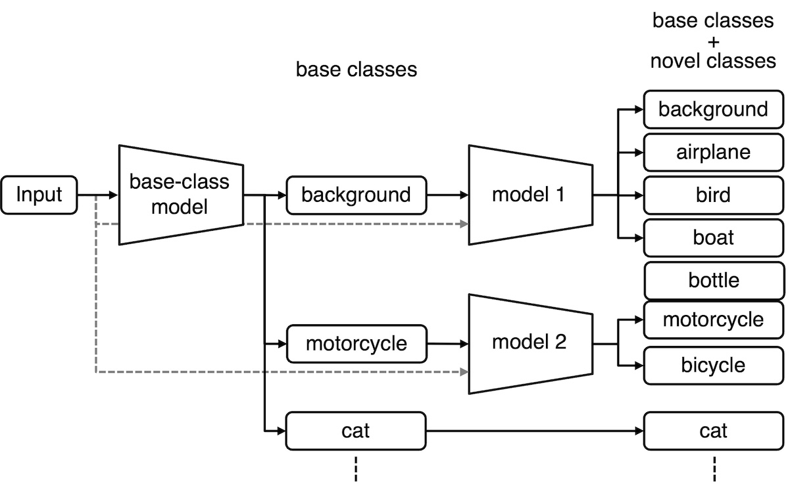

# BCM for Generalized Few-Shot Semantic Segmentation

This repository contains the code for our **NeurIPS 2024** paper, [A Surprisingly Simple Approach to Generalized Few-Shot Semantic Segmentation
](https://openreview.net/forum?id=p3nPHMpx04).

> **Abstract:** *The goal of *generalized* few-shot semantic segmentation (GFSS) is to recognize *novel-class* objects through training with a few annotated examples and the *base-class* model that learned the knowledge about base classes.Unlike the classic few-shot semantic segmentation, GFSS aims to classify pixels into both base and novel classes, meaning that GFSS is a more practical setting.To this end, the existing methods rely on several techniques, such as carefully customized models, various combinations of loss functions, and transductive learning.However, we found that a simple rule and standard supervised learning substantially improve performances.In this paper, we propose a simple yet effective method for GFSS that does not employ the techniques mentioned earlier in the existing methods.Also, we theoretically show that our method perfectly maintains the segmentation performance of the base-class model over most of the base classes.Through numerical experiments, we demonstrate the effectiveness of the proposed method.In particular, our method improves the novel-class segmentation performances in the 1-shot scenario by 6.1\% on PASCAL-$5^i$, 4.7\% on PASCAL-
$10^i$, and 1.0\% on COCO-$20^i$.*

<div align="center">

</div>

## &#x1F3AC; Getting Started

### :one: Requirements
We used `Python 3.9` in our experiments and the list of packages is available in the `pyproject.toml` file. You can install them using `uv sync` by [uv](https://github.com/astral-sh/uv).
```bash
uv sync
. .venv/bin/activate
```

### :two: Download data

#### Pre-processed data from drive

Please follow the procedure of [Download data in the DIaM repository](https://github.com/sinahmr/DIaM?tab=readme-ov-file#two-download-data).

### :three: Download pre-trained models

Please follow the procedure of [Pre-trained backbone and models in the DIaM repository](https://github.com/sinahmr/DIaM?tab=readme-ov-file#three-download-pre-trained-models).

## &#x1F5FA; Overview of the repo

Default configuration files can be found in `config/`. Data are located in `data/`. `lists/` contains the train/val splits for each dataset. All the codes are provided in `src/`. Testing script is located at the root of the repo.

## &#x1F9EA; Testing

To test the model, use the `test.sh` script, which its general syntax is:
```bash
bash test.sh {benchmark} {shot} {method} {[gpu_ids]} {log_path}
```
This script tests successively on all folds of the benchmark and reports the results individually. The overall performance is the average over all the folds. Some example commands are presented below, with their description in the comments.

```bash
bash test.sh pascal5i 1 BCM [0] out.log  # PASCAL-5i benchmark, 1-shot
bash test.sh pascal10i 5 BCM [0] out.log  # PASCAL-10i benchmark, 5-shot
bash test.sh coco20i 5 BCM [0] out.log  # COCO-20i benchmark, 5-shot
```

If you run out of memory, reduce `batch_size_val` in the config files.

### &#x1F4CA; Results
To reproduce the results, please first download the pre-trained models from [here](https://drive.google.com/file/d/1WuKaJbj3Y3QMq4yw_Tyec-KyTchjSVUG/view?usp=share_link) (also mentioned in the "download pre-trained models" section) and then run the `test.sh` script with different inputs, as explained above.
<table>
    <tr>
        <th colspan="2"></th>
        <th colspan="3">1-Shot</th>
        <th colspan="3">5-Shot</th>
    </tr>
    <tr>
        <th>Benchmark</th>
        <th>Fold</th>
        <th>Base</th> <th>Novel</th> <th>Mean</th>
        <th>Base</th> <th>Novel</th> <th>Mean</th>
    </tr>
    <tr>
        <td rowspan="5"><b>PASCAL-5<sup>i</sup></b></td>
        <td>0</td>
        <td>71.60</td> <td>36.39</td> <td>54.00</td>
        <td>71.62</td> <td>54.83</td> <td>63.22</td>
    </tr>
    <tr>
        <td>1</td>
		<td>69.52</td> <td>49.80</td> <td>59.66</td>
		<td>69.62</td> <td>61.99</td> <td>65.80</td>
    </tr>
    <tr>
        <td>2</td>
		<td>69.45</td> <td>37.93</td> <td>53.69</td>
		<td>69.49</td> <td>55.38</td> <td>62.44</td>
    </tr>
    <tr>
        <td>3</td>
		<td>74.02</td> <td>40.35</td> <td>57.19</td>
		<td>74.17</td> <td>49.26</td> <td>61.72</td>
    </tr>
    <tr>
        <td>mean</td>
		<td>71.15</td> <td>41.12</td> <td>56.14</td>
		<td>71.23</td> <td>55.37</td> <td>63.30</td>
    </tr>
    <tr>
        <td rowspan="5"><b>COCO-20<sup>i</sup></b></td>
        <td>0</td>
		<td>49.74</td> <td>14.53</td> <td>32.13</td>
		<td>49.82</td> <td>25.63</td> <td>37.73</td>
    </tr>
    <tr>
        <td>1</td>
		<td>48.13</td> <td>21.88</td> <td>35.01</td>
		<td>48.50</td> <td>35.40</td> <td>41.95</td>
    </tr>
    <tr>
        <td>2</td>
		<td>49.09</td> <td>20.56</td> <td>34.83</td>
		<td>51.20</td> <td>30.34</td> <td>40.77</td>
    </tr>
    <tr>
        <td>3</td>
		<td>50.74</td> <td>16.14</td> <td>33.44</td>
		<td>49.99</td> <td>33.44</td> <td>40.45</td>
    </tr>
    <tr>
        <td>mean</td>
		<td>49.43</td> <td>18.28</td> <td>33.85</td>
		<td>49.88</td> <td>30.57</td> <td>40.23</td>
    </tr>
    <tr>
        <td rowspan="5"><b>PASCAL-10<sup>i</sup></b></td>
        <td>0</td>
		<td>68.38</td> <td>37.96</td> <td>53.17</td>
		<td>68.49</td> <td>56.50</td> <td>62.49</td>
    </tr>
    <tr>
        <td>1</td>
		<td>71.77</td> <td>33.93</td> <td>52.85</td>
		<td>71.75</td> <td>50.46</td> <td>61.11</td>
    </tr>
    <tr>
        <td>mean</td>
		<td>70.08</td> <td>35.95</td> <td>53.01</td>
		<td>70.12</td> <td>53.48</td> <td>61.80</td>    </tr>
</table>

## &#x1F64F; Acknowledgments

We gratefully thank the authors of [DIaM](https://github.com/sinahmr/DIaM), [RePRI](https://github.com/mboudiaf/RePRI-for-Few-Shot-Segmentation), [BAM](https://github.com/chunbolang/BAM), [PFENet](https://github.com/Jia-Research-Lab/PFENet), and [PyTorch Semantic Segmentation](https://github.com/hszhao/semseg) from which some parts of our code are inspired.

## &#x1F4DA; Citation

If you find this project useful, please consider citing:

```bibtex
@inproceedings{sakai2024bcm,
  title={A Surprisingly Simple Approach to Generalized Few-Shot Semantic Segmentation},
  author={Sakai, Tomoya and Qiu, Haoxiang and Katsuki, Takayuki and Kimura, Daiki and Osogami, Takayuki and Inoue, Tadanobu},
  booktitle={Advances in Neural Information Processing Systems 37 (NeurIPS 2024)},
  pages={},
  volume = {37},
  year={2024}
}
```
